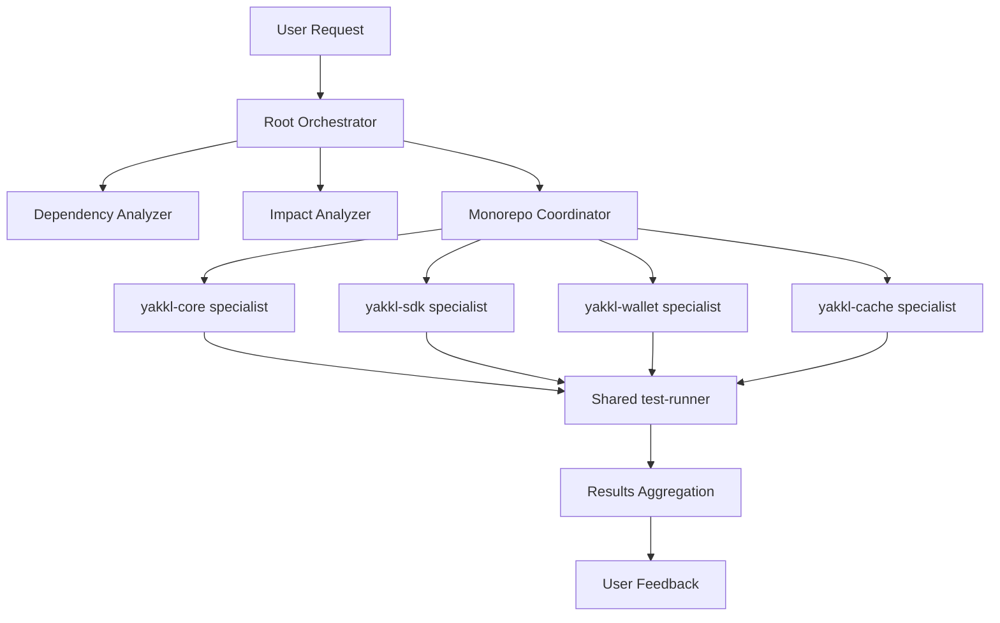

# Example Cross-Package Workflow

This document demonstrates how the orchestration system coordinates complex tasks across multiple packages.

## Example: Adding WalletConnect v3 Support

This example shows how to add WalletConnect v3 support, which requires changes across multiple packages.

### Step 1: Initial Analysis (Root Level)

```bash
# From /yakkl directory
claude "Implement WalletConnect v3 support across the platform"
```

The **monorepo-coordinator** activates and:
1. Analyzes the request
2. Identifies affected packages
3. Creates an implementation plan

### Step 2: Dependency Analysis

The **dependency-analyzer** determines:
```
Affected packages:
- yakkl-core (protocol handlers)
- yakkl-wallet (UI integration)  
- yakkl-sdk (API methods)
- yakkl-blockchain (connection management)
- yakkl-cache (session caching)
```

### Step 3: Impact Assessment

The **impact-analyzer** evaluates:
```
Impact Analysis:
- Breaking changes: No (backward compatible)
- New dependencies: @walletconnect/web3wallet
- Risk level: Medium
- Test requirements: Integration tests needed
```

### Step 4: Coordinated Implementation

The **monorepo-coordinator** orchestrates:

#### Phase 1: Core Protocol (yakkl-core)
```typescript
// packages/yakkl-core/src/protocols/walletconnect-v3.ts
export interface WalletConnectV3Protocol {
  connect(uri: string): Promise<Session>
  disconnect(topic: string): Promise<void>
  request(params: RequestParams): Promise<any>
}
```

#### Phase 2: Blockchain Integration (yakkl-blockchain)
```typescript
// packages/yakkl-blockchain/src/providers/walletconnect-v3-provider.ts
export class WalletConnectV3Provider extends BaseProvider {
  private client: WalletConnectClient
  
  async initialize(options: WCV3Options): Promise<void> {
    // Implementation
  }
}
```

#### Phase 3: SDK API (yakkl-sdk)
```typescript
// packages/yakkl-sdk/src/modules/walletconnect.ts
export class WalletConnectModule {
  async connectV3(uri: string): Promise<Connection> {
    // Delegates to core and blockchain packages
  }
}
```

#### Phase 4: Cache Management (yakkl-cache)
```typescript
// packages/yakkl-cache/src/strategies/walletconnect-session-cache.ts
export class WalletConnectSessionCache {
  async storeSession(session: Session): Promise<void>
  async getSession(topic: string): Promise<Session>
  async clearSession(topic: string): Promise<void>
}
```

#### Phase 5: UI Integration (yakkl-wallet)
```svelte
<!-- packages/yakkl-wallet/src/components/WalletConnectV3.svelte -->
<script lang="ts">
  import { WalletConnectModule } from '@yakkl/sdk'
  
  async function handleConnect(uri: string) {
    const connection = await walletConnect.connectV3(uri)
    // Update UI
  }
</script>
```

### Step 5: Testing Coordination

The orchestrator runs tests in dependency order:

```bash
1. yakkl-core tests ✓
2. yakkl-blockchain tests ✓
3. yakkl-cache tests ✓
4. yakkl-sdk tests ✓
5. yakkl-wallet tests ✓
6. Integration tests ✓
```

### Step 6: Documentation Updates

The **documentation-updater** agent:
- Updates API documentation in yakkl-sdk
- Adds usage examples to yakkl-wallet
- Updates integration guide in docs/

## Workflow Patterns

### Pattern 1: Bottom-Up Implementation
Start with core packages and work up to UI:
```
yakkl-core → yakkl-cache → yakkl-blockchain → yakkl-sdk → yakkl-wallet
```

### Pattern 2: Feature Flag Rollout
Implement behind feature flags for gradual rollout:
```typescript
if (features.walletConnectV3) {
  // New implementation
} else {
  // Legacy implementation
}
```

### Pattern 3: Parallel Development
Independent parts developed simultaneously:
```
Team A: yakkl-core + yakkl-blockchain
Team B: yakkl-sdk API design
Team C: yakkl-wallet UI mockups
```

### Pattern 4: Contract-First Development
Define interfaces first, then implement:
```
1. Define interfaces in yakkl-core
2. Mock implementations for testing
3. Real implementations in packages
4. Integration and testing
```

## Communication Flow



## Best Practices for Cross-Package Work

1. **Always Start with Analysis**
   - Use root orchestrator for initial assessment
   - Identify all affected packages upfront
   - Plan the implementation order

2. **Maintain Atomic Commits**
   - Group related changes across packages
   - Ensure each commit leaves the monorepo in a working state
   - Include all necessary updates in one PR

3. **Test in Dependency Order**
   - Core packages first
   - Then dependent packages
   - Finally integration tests

4. **Document Cross-Package Changes**
   - Update all affected package docs
   - Create migration guides if needed
   - Update the main documentation

5. **Use Feature Flags for Safety**
   - Implement new features behind flags
   - Gradual rollout across packages
   - Easy rollback if issues arise

## Common Cross-Package Scenarios

### Adding New Token Support
Packages involved: core, blockchain, wallet, sdk
```bash
claude "Add support for new ERC-404 token standard"
```

### Implementing New Security Feature
Packages involved: security, core, wallet, auth
```bash
claude "Implement biometric authentication across platform"
```

### Performance Optimization
Packages involved: cache, core, ui, wallet
```bash
claude "Optimize rendering performance for large portfolios"
```

### New Chain Integration
Packages involved: blockchain, core, sdk, wallet
```bash
claude "Add support for Arbitrum network"
```

## Troubleshooting Cross-Package Issues

### Dependency Conflicts
- Run dependency analyzer
- Check for version mismatches
- Use pnpm's resolution features

### Build Order Problems
- Verify package.json dependencies
- Check for circular dependencies
- Use topological sorting for build order

### Test Failures in Integration
- Isolate to specific package combinations
- Check for race conditions
- Verify mock/stub compatibility

### Version Synchronization
- Use release manager for coordinated versions
- Maintain compatibility matrix
- Document breaking changes clearly