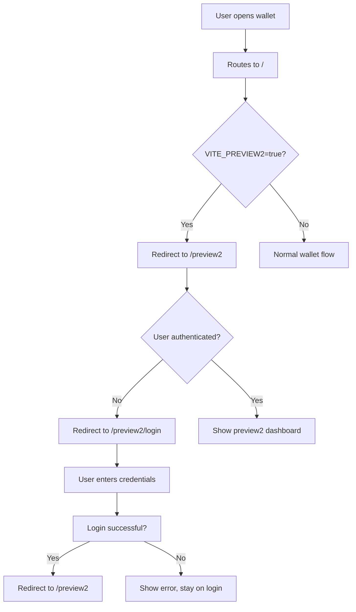

# Preview2 Routing Flow

## ✅ **How Preview2 Login Works Now**

### **Development Mode** (`pnpm run dev2:wallet`)
The `dev2:wallet` script sets `VITE_PREVIEW2=true`, which creates this flow:



### **Authentication Check Flow**
1. **Initial Load**: `src/routes/(wallet)/+page.svelte`
   - Checks `VITE_PREVIEW2=true` → redirects to `/preview2`

2. **Preview2 Dashboard**: `src/routes/preview2/+page.svelte`
   - Checks if `settings.isLocked !== false`
   - If locked/unauthenticated → redirects to `/preview2/login`
   - If authenticated → loads dashboard

3. **Preview2 Login**: `src/routes/preview2/login/+page.svelte`
   - Uses clean layout (no header/dock)
   - On successful login → redirects to `/preview2`
   - Uses lean logger and optimized components

### **Key Files Modified**

#### `src/routes/(wallet)/+page.svelte`
```typescript
// Development redirect to preview2
if (import.meta.env.VITE_PREVIEW2 === 'true') {
  return await goto('/preview2');
}
```

#### `src/routes/preview2/+page.svelte`  
```typescript
// Authentication check
const settings = await getSettings();
if (!settings || settings.isLocked !== false) {
  return await goto('/preview2/login');
}
```

#### `src/routes/preview2/login/+layout.svelte`
```svelte
<!-- Clean login layout - no header, no dock -->
<div class="yakkl-body min-h-screen flex items-center justify-center">
  <main class="w-full">
    {@render children?.()}
  </main>
</div>
```

## **What You Should See**

### **When Opening the Wallet**:
1. **First Time**: 
   - Redirects to `/preview2/login` (clean, centered login)
   - After login → `/preview2` dashboard with new UI

2. **Already Logged In**:
   - Directly shows `/preview2` dashboard
   - New lean UI with DockLauncher, AIHelpButton, etc.

3. **Logout**:
   - Returns to `/preview2/login` for re-authentication

### **Environment Behavior**

| Environment | Behavior |
|---|---|
| `dev2:wallet` | Always uses preview2 (VITE_PREVIEW2=true) |
| `dev:wallet` | Uses original wallet |
| Production | Uses original wallet (preview2 isolated) |

## **Testing the Flow**

### **Fresh Start** (Clear Extension Data):
1. `pnpm run dev2:wallet`
2. Open extension → should redirect to preview2 login
3. Enter credentials → should redirect to preview2 dashboard

### **Already Authenticated**:
1. `pnpm run dev2:wallet` 
2. Open extension → should go directly to preview2 dashboard

### **Switch Between Versions**:
```bash
# Test preview2
pnpm run dev2:wallet

# Test original  
pnpm run dev:wallet
```

## **Troubleshooting**

### **If you see the old login**:
- Check that `dev2:wallet` script is running (look for `VITE_PREVIEW2=true` in logs)
- Clear browser extension data and try again
- Check browser console for redirect logs

### **If authentication doesn't work**:
- Check that the login component can access shared authentication functions
- Verify the success callback redirects to `/preview2`

**The preview2 login should now be active when using `dev2:wallet`! 🚀**