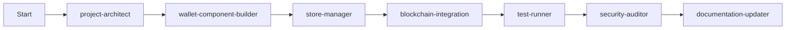
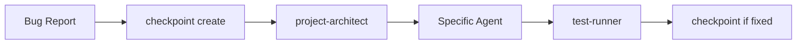
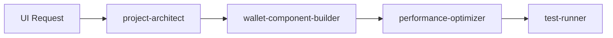
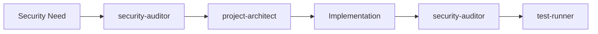

# WORKFLOW.md

Best practices and workflows for developing YAKKL Smart Wallet v2 with Claude Code.

## 🎯 Optimal Prompt Structure

### The Perfect Prompt Formula
```
1. **Context**: "Working on [specific area] of YAKKL wallet v2"
2. **Current State**: "Currently have [what exists/works]"
3. **Specific Goal**: "Need to [exact outcome]"
4. **Constraints**: "Must follow [rules/patterns]"
5. **Success Criteria**: "Complete when [measurable outcome]"
```

### Real Examples

#### ❌ Poor Prompt
"Fix the wallet"

#### ✅ Good Prompt
"Working on token display in YAKKL wallet v2. Currently tokens show but prices are wrong for sub-penny values. Need to format prices to show '< $0.01' for values under one cent. Must follow existing BigNumber patterns in token.store.ts. Complete when all tokens display correctly formatted prices."

#### ❌ Vague Request
"Add a new feature"

#### ✅ Specific Request
"Working on wallet popup UI. Currently have basic token list. Need to add token swap modal using existing Modal pattern from $lib/components/Modal.svelte. Must follow Rule #22 for modals and use wallet-component-builder patterns. Complete when users can open swap modal and see token selection."

## 🔄 Standard Development Workflows

### 1. New Feature Workflow


**Example**: "Add multi-signature support"
1. `Use project-architect to analyze multi-sig feature requirements`
2. `Use wallet-component-builder to create MultiSig UI components`
3. `Use store-manager for multi-sig state management`
4. `Use blockchain-integration for contract interactions`
5. `Use test-runner to validate implementation`
6. `Use security-auditor to review security implications`
7. `Use documentation-updater to update docs`

### 2. Bug Fix Workflow


**Example**: "Transaction fails with gas error"
1. `/checkpoint create "before gas error fix"`
2. `Use project-architect to analyze gas calculation issue`
3. `Use blockchain-integration to fix gas estimation`
4. `Use test-runner to verify fix`
5. `/checkpoint create "gas error fixed"`

### 3. UI Enhancement Workflow


**Example**: "Improve token list performance"
1. `Use project-architect to analyze current implementation`
2. `Use wallet-component-builder to implement virtual scrolling`
3. `Use performance-optimizer to measure improvements`
4. `Use test-runner to ensure functionality`

### 4. Security Feature Workflow


**Always start and end with security-auditor for sensitive features**

## 🛠️ Common Task Patterns

### Creating a New Component
```
Prompt: "Create a new TokenSwap component in wallet popup. Need to follow existing Modal pattern, use Svelte 5 runes, integrate with token and chain stores. Should allow selecting from/to tokens and entering amounts."

Claude will:
1. Use project-architect to understand structure
2. Use wallet-component-builder to create component
3. Follow Rule #22 for modal pattern
4. Use $state and $props runes
5. Integrate with existing stores
```

### Adding Blockchain Feature
```
Prompt: "Add ERC-721 NFT support to wallet. Need to detect NFTs on current chain, display in separate tab, show metadata. All blockchain calls must be in background context following Rule #6."

Claude will:
1. Use project-architect for impact analysis
2. Use blockchain-integration for NFT detection
3. Ensure all Web3 calls in background
4. Use message passing to UI
5. Create proxy in client context
```

### Fixing Store Issues
```
Prompt: "Token balances not updating when switching chains. Currently using tokenStore but seems to cache old chain data. Need real-time updates when currentChain changes."

Claude will:
1. Use store-manager to analyze issue
2. Check for proper store dependencies
3. Implement proper cleanup
4. Add chain-reactive updates
5. Test with multiple chains
```

## 📋 Pre-Flight Checklist

Before starting any task:
- [ ] Clear goal defined
- [ ] Current state understood  
- [ ] Success criteria specified
- [ ] Relevant rules identified
- [ ] Checkpoint created if needed

## 🚨 When to Reset Context

Consider a context refresh when:
1. **After 50+ messages** - Context getting full
2. **Switching major features** - From UI to blockchain work
3. **After complex debugging** - Clean slate helps
4. **Performance degradation** - Responses getting slow

How to refresh:
```
"Let's start fresh. Working on [new area]. Here's the current state: [summary]. Need to [goal]."
```

## 💡 Pro Tips

### 1. Use Agents Proactively
Don't wait to be prompted:
- "Use project-architect to..." 
- "Use test-runner after..."
- "Use security-auditor to review..."

### 2. Batch Related Work
Instead of:
- "Add button"
- "Make it blue"
- "Add click handler"

Do:
- "Add blue button with click handler that opens token swap modal"

### 3. Reference Existing Code
- "Follow pattern from TokenList.svelte"
- "Use same structure as accountStore"
- "Match style from Settings page"

### 4. Specify Output Format
- "Show me the complete component"
- "Just show the changes needed"
- "Give me step-by-step instructions"

### 5. Use Commands Effectively
- `/checkpoint create` before risky changes
- `/context ui` when starting UI work
- `/rules imports` when confused about imports
- `/doc-updater` after completing features

## 🔍 Debugging Workflows

### Build Errors
1. Share complete error message
2. Mention which command failed
3. Include relevant file paths
4. Specify Node/pnpm versions if relevant

### Runtime Errors
1. Browser console output
2. Network tab if API related
3. Extension background page logs
4. Relevant store states

### Type Errors
1. Full TypeScript error
2. File and line number
3. Current type definitions
4. Expected vs actual types

## 📊 Progress Tracking

Use todos effectively:
```
"Create todos for implementing wallet connect feature:
1. Research WalletConnect v2 protocol
2. Add connection UI components  
3. Implement session management
4. Add transaction approval flow
5. Test with popular dApps"
```

## 🎓 Learning the System

Best order to understand YAKKL:
1. Read `PROJECT_CONTEXT.md` - Architecture and rules
2. Read `CLAUDE.md` - Current status
3. Explore `.claude/agents/` - Specialized capabilities
4. Try `/context` command - Get oriented
5. Use `/rules` for quick reference

## 🚀 Productivity Shortcuts

### Quick Starts
- **New Page**: "Create settings page following existing routes pattern"
- **New Store**: "Create theme store like existing wallet store"
- **New Component**: "Create TokenBadge like existing components"

### Efficient Debugging
- **With Context**: "Getting error X when doing Y in file Z"
- **With History**: "This worked before commit ABC"
- **With Comparison**: "Works in v1 but not v2"

### Bulk Operations
- **Multi-file**: "Update all imports of X to use Y"
- **Refactor**: "Extract common logic from A, B, C into utility"
- **Upgrade**: "Update all components to use new Modal pattern"

Remember: The more specific your request, the better the result. Use agents proactively, follow established patterns, and maintain checkpoints for safety.