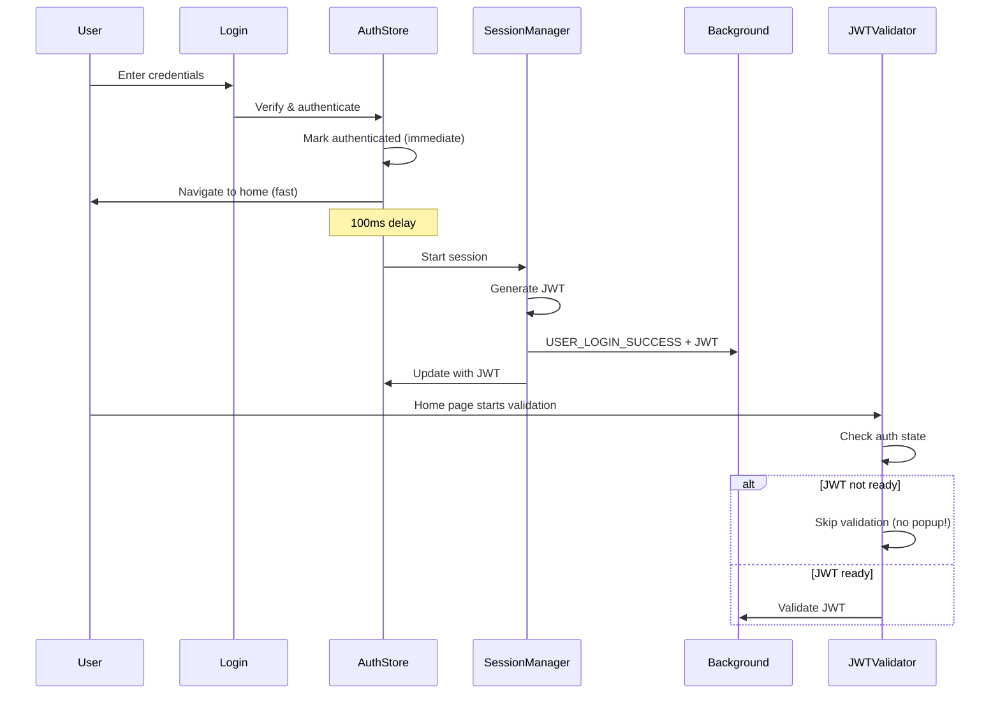

# JWT Fix Complete - 2025-01-17

## Problem Solved
The "JWT Invalid" dialog was appearing immediately after login due to a race condition between JWT generation and validation.

## Root Cause
1. Login marks user as authenticated immediately (for fast UX)
2. JWT generation happens asynchronously (100ms delay)
3. JWT validation service starts immediately when home page loads
4. Validation fails because JWT isn't ready yet → Shows popup

## Solution Implemented

### File Modified: `/lib/services/ui-jwt-validator.service.ts`

**Key Changes:**
1. **Line 298-302**: Added check for authenticated-but-no-JWT state
   - If user is authenticated but JWT not ready, skip validation entirely
   - Prevents false "JWT Invalid" popup

2. **Line 334-337**: Fixed session state validation
   - JWT is now the source of truth
   - Session state can update asynchronously without failing validation

## Current JWT Flow (Working)

## Files Cleaned Up

Moved to `/deadcode/jwt/`:
- `ui-jwt-validator.service.ts.20250813.backup`
- `jwt-background.test.ts`
- `identity-adapter.ts` (copy - original still in use)

## Future Architecture (Documented)

See `/docs/JWT_MIGRATION_PLAN.md` for the plan to:
1. Move JWT logic to yakkl-security package
2. Create browser-specific JWT adapters
3. Keep only UI components in wallet

## Testing Checklist

- [x] Login doesn't show "JWT Invalid" popup
- [x] JWT is generated after successful login
- [x] Background receives USER_LOGIN_SUCCESS message
- [x] JWT validation works after generation
- [x] Session timeout still functions
- [x] Logout clears JWT properly

## What's Next

### Immediate (Current Working State)
- The fix is complete and working
- No more false "JWT Invalid" popups
- JWT generation happens properly after login

### Future Refactoring
1. **Move to yakkl-security** (documented in migration plan)
   - Core JWT logic should be in security package
   - Wallet should only have UI components

2. **Benefits of Migration**
   - Single source of truth for JWT
   - Reusable across YAKKL products
   - Better security isolation
   - Centralized testing

## Important Notes

1. **JWT Generation Timing**: JWT is correctly generated AFTER successful login (not before)
2. **Grace Period**: 5-minute grace period prevents false positives during JWT propagation
3. **Background Handler**: USER_LOGIN_SUCCESS is properly handled in session.ts
4. **Security**: All security features remain intact - just smarter validation timing