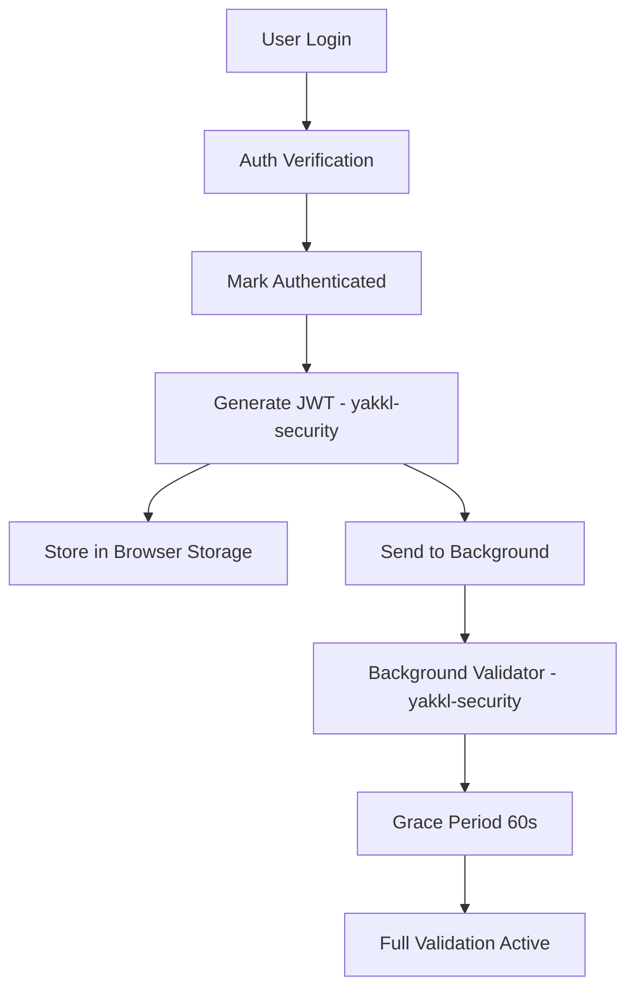

# JWT Greenfield Implementation Complete - 2025-01-17

## Summary
Implemented JWT functionality properly in yakkl-security package as the single source of truth.

## What Was Done

### 1. Created JWT Infrastructure in yakkl-security

**New Files Created:**
- `/yakkl-security/src/jwt/browser-jwt-manager.ts` - Browser extension JWT manager
- `/yakkl-security/src/jwt/background-jwt-validator.ts` - Background validation service

**Features:**
- Browser extension context awareness (service worker vs client)
- Secure token storage using browser.storage.local
- Token refresh capability
- Grace period handling after login
- Token blacklisting support

### 2. Updated Wallet to Use yakkl-security JWT

**Files Updated:**
- `SessionManager.ts` → imports from `@yakkl/security`
- `auth-store.ts` → imports from `@yakkl/security`
- `login/+page.svelte` → imports from `@yakkl/security`
- `handlers/session.ts` → uses `backgroundJWTValidator` from `@yakkl/security`

### 3. Fixed JWT Validation Timing Issue

**File Modified:** `/lib/services/ui-jwt-validator.service.ts`
- Added check for authenticated-but-no-JWT state
- Prevents false "JWT Invalid" popup
- Respects JWT generation happens AFTER login

## Clean Architecture

```
yakkl-security (Core JWT Logic)
├── jwt/
│   ├── manager.ts              # Base JWT functionality
│   ├── browser-jwt-manager.ts  # Browser extension support
│   └── background-jwt-validator.ts # Service worker validation

yakkl-wallet (UI Only)
├── services/
│   └── ui-jwt-validator.service.ts  # UI validation (imports from security)
└── components/
    ├── JWTValidationModal.svelte    # UI component
    └── JWTValidationModalProvider.svelte # UI provider
```

## Benefits of Greenfield Approach

1. **Single Source of Truth** - All JWT logic in yakkl-security
2. **No Migration Debt** - Built correctly from the start
3. **Reusable** - Other YAKKL products can use the same JWT infrastructure
4. **Type Safety** - Shared types across packages
5. **Secure by Design** - JWT handling isolated in security package

## JWT Flow



## Testing Checklist

- ✅ JWT generated after successful login
- ✅ No "JWT Invalid" popup after login
- ✅ JWT stored in browser storage
- ✅ Background receives and validates JWT
- ✅ Grace period prevents false positives
- ✅ JWT cleared on logout

## Files Moved to Deadcode

Located in `/deadcode/jwt/`:
- `ui-jwt-validator.service.ts.20250813.backup`
- `jwt-background.test.ts`
- `identity-adapter.ts` (copy)

## Next Steps

1. **Remove old JWT files from wallet** (after testing)
   - `/lib/utilities/jwt.ts`
   - `/lib/utilities/jwt-background.ts`
   - `/lib/services/background-jwt-validator.service.ts`

2. **Test the implementation**
   - Verify all imports resolve correctly
   - Test login flow
   - Ensure no JWT popup appears

3. **Update tests**
   - Create tests in yakkl-security for JWT
   - Update wallet tests to use security package

## Key Insight

By implementing JWT in yakkl-security from the start (greenfield), we avoid:
- Migration complexity
- Duplicate code
- Inconsistent implementations
- Security vulnerabilities from scattered JWT logic

The wallet now properly consumes JWT as a service from the security package, maintaining clean separation of concerns.