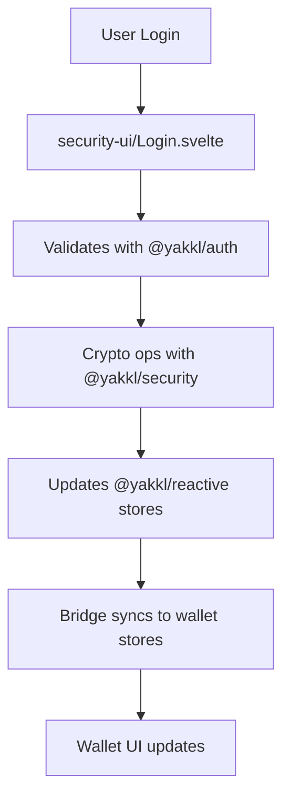

# YAKKL Security Architecture Documentation

## Overview
This document describes the new modular security architecture for YAKKL Smart Wallet, designed to eliminate circular dependencies and enable code reuse across different applications.

## Architecture Layers

### 1. Framework-Neutral Core Libraries

#### @yakkl/security (Private)
- **Purpose**: Core cryptographic and security operations
- **Framework**: None (pure TypeScript)
- **Key Features**:
  - Encryption/decryption functions
  - Password hashing (Argon2, bcrypt)
  - Key derivation functions
  - Digital signatures
  - JWT token generation/validation
  - Emergency kit generation

```typescript
import { encrypt, decrypt, hashPassword } from '@yakkl/security';

// Example usage
const encrypted = await encrypt(data, password);
const decrypted = await decrypt(encrypted, password);
```

#### @yakkl/auth (Private)
- **Purpose**: Authentication orchestration and business logic
- **Framework**: None (pure TypeScript)
- **Key Features**:
  - Login/logout flows
  - Registration logic
  - Session management
  - Rate limiting
  - Auth event auditing
  - Multi-factor authentication

```typescript
import { AuthManager } from '@yakkl/auth';

const authManager = new AuthManager();
const result = await authManager.login(username, password);
```

#### @yakkl/reactive
- **Purpose**: Framework-neutral reactive state management
- **Framework**: None (compatible with Svelte stores API)
- **Key Features**:
  - Writable/readable/derived stores
  - Auth state management
  - Security state management
  - Registration flow state

```typescript
import { authStore, sessionStore } from '@yakkl/reactive/stores';

// Works with any framework
authStore.subscribe(state => {
  console.log('Auth state:', state);
});
```

### 2. UI Component Libraries

#### @yakkl/security-ui (Private)
- **Purpose**: Svelte UI components for security features
- **Framework**: Svelte 5
- **Dependencies**: 
  - @yakkl/security (for logic)
  - @yakkl/reactive (for stores)
  - **NO dependency on yakkl-wallet** (prevents circular deps)
- **Components**:
  - Login.svelte
  - Register.svelte
  - PasswordInput.svelte
  - EmergencyKit.svelte
  - SessionWarning.svelte

```svelte
<!-- Example usage in wallet -->
<script>
  import { Login } from '@yakkl/security-ui';
  import { getWalletContext } from '$lib/bridges/wallet-context-provider';
  
  const walletContext = getWalletContext();
</script>

<Login {walletContext} on:success={handleLoginSuccess} />
```

### 3. Integration Bridge

#### @yakkl/security-bridge (Private)
- **Purpose**: Bridge between wallet and security packages
- **Key Features**:
  - WalletContext interface definition
  - Store synchronization utilities
  - Security context providers
  - Event coordination

```typescript
// WalletContext interface that wallet must implement
export interface WalletContext {
  navigateTo: (path: string) => Promise<void>;
  storage: StorageInterface;
  preferences: PreferencesInterface;
  wallet: WalletStateInterface;
  events: EventInterface;
}
```

### 4. Application Layer

#### yakkl-wallet
- **Purpose**: Browser extension wallet application
- **Implements**: WalletContext for security components
- **Uses**:
  - @yakkl/security for crypto operations
  - @yakkl/auth for authentication
  - @yakkl/security-ui for UI components
  - @yakkl/security-bridge for integration

## Data Flow

### Authentication Flow



### Store Synchronization

```typescript
// In yakkl-wallet initialization
import { initializeAuthBridge } from '$lib/bridges/auth-store-bridge';

// Initialize bridge on app start
onMount(() => {
  const bridge = initializeAuthBridge({
    syncInterval: 5000,
    enableLogging: true
  });
  
  // Bridge automatically syncs:
  // - @yakkl/reactive stores <-> wallet stores
  // - Maintains consistency across packages
});
```

## Migration Strategy

### Phase 1: Infrastructure (Complete)
✅ Remove circular dependency in yakkl-security-ui
✅ Create @yakkl/security-bridge package
✅ Create auth stores in @yakkl/reactive
✅ Create integration bridges in wallet

### Phase 2: Code Movement (Pending)
- [ ] Move encryption.ts to @yakkl/security
- [ ] Move jwt utilities to @yakkl/security
- [ ] Move auth validation to @yakkl/auth
- [ ] Move session management to @yakkl/auth

### Phase 3: Component Migration (Pending)
- [ ] Move Login.svelte to @yakkl/security-ui
- [ ] Move Register.svelte to @yakkl/security-ui
- [ ] Update components to use WalletContext
- [ ] Test all auth flows

### Phase 4: Testing & Validation
- [ ] Unit tests for each package
- [ ] Integration tests for bridges
- [ ] E2E tests for auth flows
- [ ] Security audit

## Benefits

### 1. No Circular Dependencies
- Clean dependency graph
- Easier to maintain and test
- Better build performance

### 2. Framework Neutrality
- Core logic usable in React, Vue, vanilla JS
- Enables multi-platform strategy
- Future-proof architecture

### 3. Code Reusability
- Auth/security shared across all YAKKL apps
- Consistent security implementation
- Reduced duplication

### 4. Security Isolation
- Sensitive code in private packages
- Clear security boundaries
- Easier security audits

## Usage Examples

### Using Security UI Components

```svelte
<!-- In yakkl-wallet route -->
<script lang="ts">
  import { Register } from '@yakkl/security-ui';
  import { getWalletContext } from '$lib/bridges/wallet-context-provider';
  import { goto } from '$app/navigation';
  
  const walletContext = getWalletContext();
  
  function handleRegistrationSuccess(event) {
    const { userId, username } = event.detail;
    console.log('Registration successful:', userId);
    goto('/dashboard');
  }
</script>

<Register 
  {walletContext}
  on:success={handleRegistrationSuccess}
  on:error={handleRegistrationError}
/>
```

### Using Reactive Stores

```typescript
// In any JavaScript/TypeScript file
import { 
  authStore, 
  sessionStore,
  isAuthenticated 
} from '@yakkl/reactive/stores';

// Subscribe to auth state
const unsubscribe = authStore.subscribe(state => {
  if (state.isAuthenticated) {
    console.log('User logged in:', state.username);
  }
});

// Update auth state
authStore.update(state => ({
  ...state,
  lastActivity: Date.now()
}));

// Use derived stores
isAuthenticated.subscribe(authenticated => {
  console.log('Is authenticated:', authenticated);
});
```

### Implementing WalletContext

```typescript
// In yakkl-wallet
import type { WalletContext } from '@yakkl/security-bridge';

export function createWalletContext(): WalletContext {
  return {
    navigateTo: async (path) => {
      await goto(path);
    },
    
    storage: {
      get: async (key) => localStorage.getItem(key),
      set: async (key, value) => localStorage.setItem(key, value),
      remove: async (key) => localStorage.removeItem(key)
    },
    
    wallet: {
      isLocked: () => !walletUnlocked,
      lock: async () => lockWallet(),
      unlock: async (password) => unlockWallet(password),
      // ... other wallet methods
    },
    
    // ... other context implementations
  };
}
```

## Security Considerations

### 1. Package Privacy
- All security packages are private (not published to npm)
- Source code in private git repos
- Build artifacts copied during build process

### 2. Sensitive Data Handling
- Passwords never stored in plain text
- Private keys encrypted at rest
- Session tokens with expiration
- Secure random generation for all crypto

### 3. Input Validation
- All inputs validated at UI layer
- Re-validated at business logic layer
- Sanitization before storage
- Rate limiting on auth attempts

### 4. Audit Logging
- All auth events logged
- Failed attempts tracked
- Rate limiting based on IP/user
- Audit logs encrypted

## Troubleshooting

### Common Issues

#### 1. Store Sync Issues
```typescript
// Force manual sync
import { getAuthBridge } from '$lib/bridges/auth-store-bridge';

const bridge = getAuthBridge();
bridge?.syncStores();
```

#### 2. Context Not Available
```typescript
// Ensure context is provided to components
<SecurityProvider {walletContext}>
  <Login />
</SecurityProvider>
```

#### 3. Import Errors
```bash
# Rebuild packages
cd packages/yakkl-security && pnpm build
cd packages/yakkl-auth && pnpm build
cd packages/yakkl-reactive && pnpm build
```

## Future Enhancements

### Planned Features
1. **Biometric Authentication**: TouchID/FaceID support
2. **Hardware Security Keys**: YubiKey integration
3. **Social Recovery**: Multi-sig recovery options
4. **Zero-Knowledge Proofs**: Privacy-preserving auth
5. **Decentralized Identity**: DID integration

### Architecture Evolution
1. **Micro-frontends**: Independent security UI deployment
2. **WASM Crypto**: High-performance crypto operations
3. **Service Workers**: Offline auth capabilities
4. **Edge Functions**: Distributed auth validation

## Conclusion

This new architecture provides a solid foundation for YAKKL's security infrastructure, eliminating circular dependencies while enabling code reuse across multiple applications. The modular design ensures maintainability, testability, and security while supporting future growth and platform expansion.